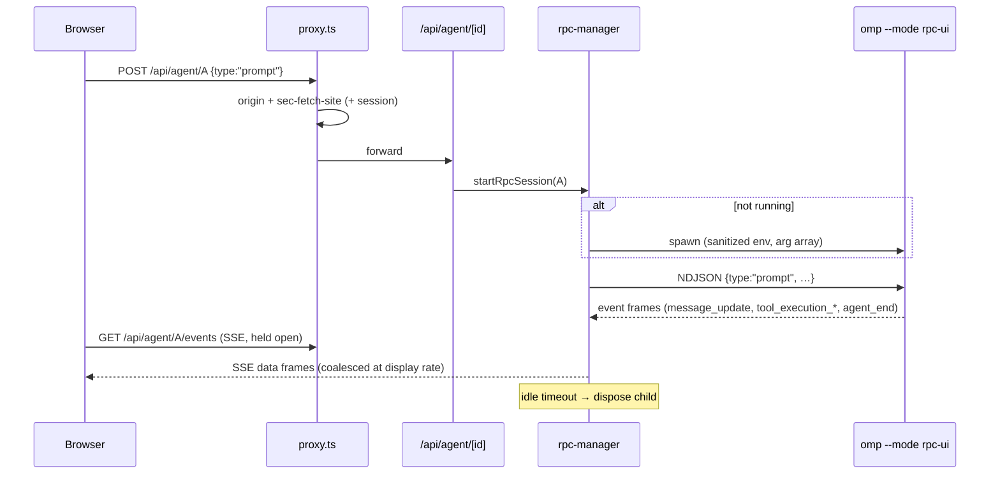

# API surface map

Every route handler at `330db7d` (fork base), grouped by domain. **All routes
are behind `proxy.ts`** (CSRF/origin gate always; password session when
`OMP_WEB_PASSWORD` is set). "Source" = where the data comes from:
**disk** (pure-Node read of `~/.omp/agent`), **rpc** (spawned `omp --mode rpc-ui`),
**cli** (shells out to `omp`/`npx`), **net** (outbound HTTP).

## Live agent

| Route | Methods | Source | Notes |
|---|---|---|---|
| `/api/agent/new` | POST | rpc | spawn session: `{cwd, message, toolNames?, provider?, modelId?}` |
| `/api/agent/[id]` | GET, POST | rpc | state read / any RPC command passthrough |
| `/api/agent/[id]/events` | GET | rpc→SSE | per-session event stream |
| `/api/agent/[id]/bash-output` | GET | rpc | live bash tool output |
| `/api/agent/running/events` | GET | rpc-mgr | SSE of running session ids (sidebar badges) |
| `/api/agents` | GET,POST,PUT,DELETE | disk? | task-agent definitions (verify source) |

## Sessions

| Route | Methods | Source |
|---|---|---|
| `/api/sessions` | GET | disk (cached list) |
| `/api/sessions/[id]` | GET,PATCH,DELETE | disk |
| `/api/sessions/[id]/context?leafId=` | GET | disk (branch context) |
| `/api/sessions/[id]/state` | GET | disk |
| `/api/sessions/[id]/export` | GET | disk → HTML |
| `/api/sessions/[id]/auto-name` | POST | rpc |
| `/api/sessions/[id]/archive` · `/api/sessions/archive` | POST / GET,POST | disk |
| `/api/sessions/[id]/entries/[entryId]/thinking` | GET | disk (blob-backed) |
| `/api/sessions/[id]/subagents[/{subagentId}]` | GET | disk (sibling artifacts) |
| `/api/sessions/import` | POST | disk write |

## Models, auth, providers

| Route | Methods | Source | Notes |
|---|---|---|---|
| `/api/models` | GET | rpc | models + defaults |
| `/api/models-config` | GET,PUT | disk (`models.yml`) | ⚠️ M1: inline `apiKey` round-trips today ([[docs/security/2026-09-18-security-review]]) |
| `/api/models-config/catalog` · `/test` | GET · POST | net/rpc | catalog fetch; provider test |
| `/api/model-roles` | PUT | disk | role aliases (defaultModel/smallModel…) |
| `/api/auth/providers` · `/all-providers` | GET | rpc | login providers |
| `/api/auth/login/[provider]` | GET,POST | rpc | OAuth bridge (secret prompts rejected by omp RPC) |
| `/api/auth/logout/[provider]` | POST | rpc | |
| `/api/auth/api-key/[provider]` | GET,POST,DELETE | rpc | status only — never returns keys (I-6) |
| `/api/providers/enable` | POST | disk | provider visibility |
| `/api/provider-usage` · `/api/usage` | GET | disk/rpc | usage & cost views |

## Workspace: files, git, worktrees, projects

| Route | Methods | Source | Notes |
|---|---|---|---|
| `/api/files/[...path]` | GET,POST | disk | allowlisted roots + upload (I-4, I-8) |
| `/api/file-index` | GET | disk | search within roots |
| `/api/cwd/browse` · `/validate` · `/default-cwd` | GET · POST · POST | disk | register new roots (`allowFileRoot()`) |
| `/api/home` | GET | env | user home |
| `/api/git/status` · `/api/git/diff` | GET | cli (git) | `cwd` validated against roots |
| `/api/worktrees` | GET,POST,DELETE | cli (git) | create under `<repoRoot>-worktrees/` |
| `/api/projects` | GET,POST,PATCH,DELETE | disk (`projects.json`) | managed-projects registry |

## Extensions: skills, plugins, MCP

| Route | Methods | Source | Notes |
|---|---|---|---|
| `/api/skills` | GET,PATCH | disk | discovery mirror; toggles `disable-model-invocation` |
| `/api/skills/search` · `/install` · `/update` · `/check` | POST | net/cli | skills.sh + `npx skills add` + git hashes |
| `/api/plugins` | GET,POST | cli | shells to `omp plugin …` |
| `/api/mcp` | GET,POST,PUT,DELETE | disk (`.omp/mcp.json`) | sanitized DTOs to client (I-10) |

## App & runtime

| Route | Methods | Source | Notes |
|---|---|---|---|
| `/api/web-auth/session` | POST | local | password → signed cookie (I-3) |
| `/api/app-update` · `/notes` | GET,POST · GET | net | npm check + two-phase self-update (I-9) |
| `/api/omp-update` · `/omp-version` | POST · GET | cli | `omp update --check`, restart sessions |
| `/api/omp-settings` | PUT | disk | allow-listed `config.yml` settings |
| `/api/stt` | POST | net (user endpoint) | speech-to-text proxy |
| `/api/windows-service` | GET,POST | local | Windows service/shortcut management |

## Request flow (live prompt)

Maintenance rule (A2): update this table in the same commit that adds/removes
a route.
