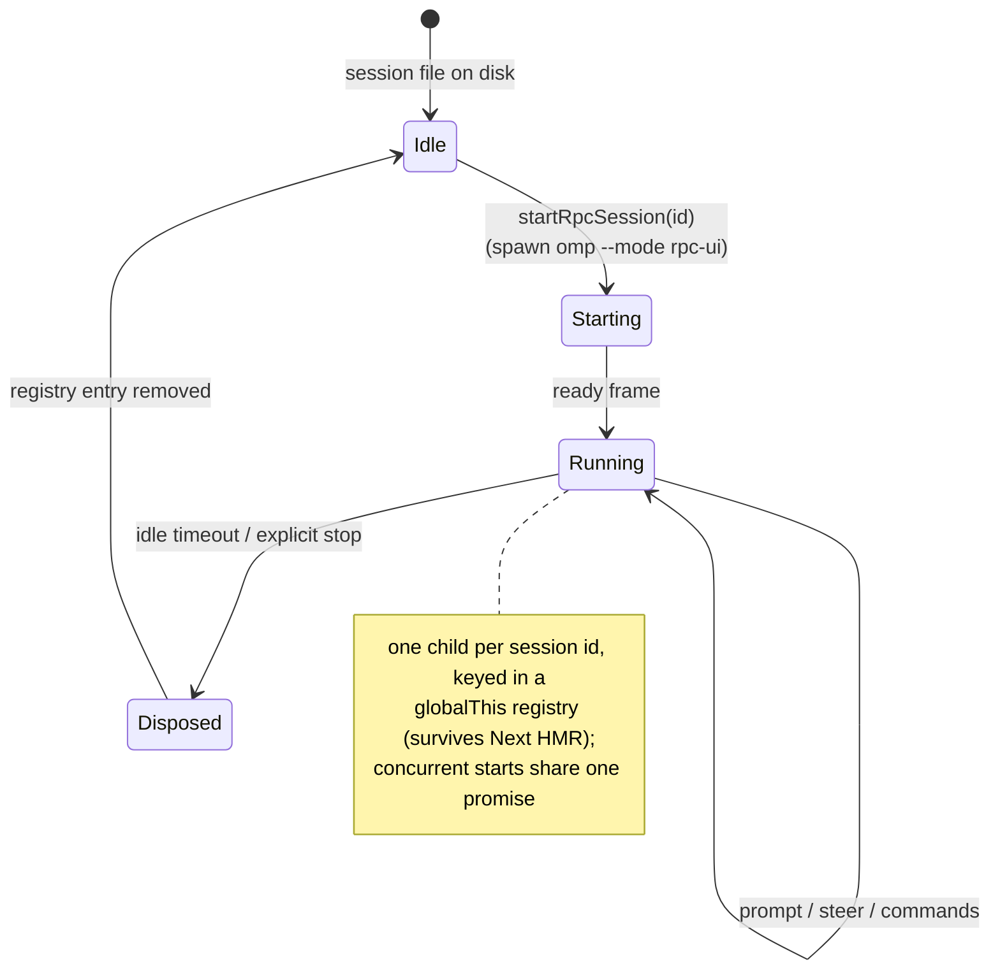
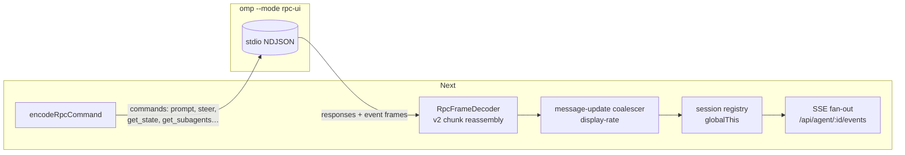

# The omp connection

How the web UI reaches the agent: process lifecycle, wire protocol, and the
on-disk contract shared with the TUI. Authoritative code:
`lib/omp/rpc-process.ts`, `lib/rpc-manager.ts`, `lib/session-reader.ts`.

## Process model



- Spawn: `execFile`-style with **arg arrays + sanitized env** (invariant I-7);
  binary located by `lib/omp/omp-cli.ts` (`PATH` or `OMP_WEB_OMP_BIN`).
- Mode: `omp --mode rpc-ui` — RPC over stdio **plus** extension-UI events
  (dialogs round-trip to the browser).

## Wire protocol (NDJSON stdio)



Commands the UI sends today (source of truth: grep `type:` in `lib/` +
`hooks/useAgentSession*`): `prompt`, `abort`, `get_state`, `get_available_models`,
`get_login_providers`, `login`, `get_subagents`, `get_subagent_messages`,
`set_model`, `set_thinking_level`, `compact`, `export_html`, session/branch
ops — full list tracked in [[docs/parity/tui-vs-web]].

**Event deltas vs pi** (from `AGENTS.md`): no `prompt_done`/`prompt_error`/
`queue_update`; completion = `agent_end` with `isTerminal !== false`; queue
length from `get_state.queuedMessageCount`; new frame types must be handled or
safely ignored.

## On-disk contract (shared with TUI)

```
~/.omp/agent/
  sessions/<encoded-cwd>/<timestamp>_<uuid>.jsonl   ← entry tree (id,parentId)
  blobs/<hash>                                       ← externalized images
  <session-dir>/<subagent-id>.jsonl                  ← subagent transcripts
  models.yml · config.yml · projects.json            ← settings the UI edits
  agent.db                                           ← credentials (UI NEVER touches)
```

- Line 1: fixed 256-byte padded title slot (older files may lack it).
- Entries form a **tree**; the UI maps displayed messages → entry ids via
  `entryIds[]` for fork/navigate operations.
- Two distinct branchings: **fork** = new `.jsonl` (`parentSession`);
  **in-session branch** = sibling `parentId`s in the same file
  (`/api/sessions/[id]/context?leafId=`).

## Reconciliation & reliability

- Sidebar running badges: `/api/agent/running/events` SSE (no polling).
- `useAgentSession` reconciles via `GET /api/agent/[id]` during runs +
  `visibilitychange`/`online` (missed `agent_end` recovery); monotonic run ids
  prevent stale-streaming resurrection.
- Live tool output: `tool_execution_start/update/end` with FULL accumulated
  partial per frame; committed `toolResult` always wins.
