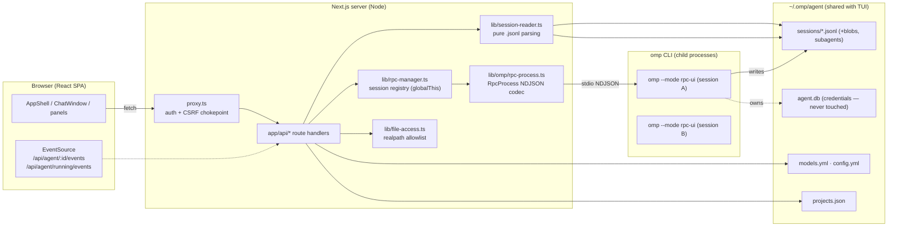

# System overview

omp-ui is a **local-first Next.js 16 app** that never imports the Bun-only
`@oh-my-pi/*` SDK. It talks to omp through two independent paths:

1. **Read path** — pure-Node parsing of omp's on-disk state (sessions,
   projects, skills, usage). No child process; works even without `omp` on PATH.
2. **Live path** — one spawned `omp --mode rpc-ui` child process per active
   session, driven over NDJSON stdio (RPC protocol v1/v2), streamed to the
   browser via SSE.

## Key properties

- **Shared state, no lock-in**: the TUI and the web UI read/write the same
  `~/.omp/agent` state; either can act on a session the other created.
- **One process per live session**, keyed by session id in a `globalThis`
  registry (survives Next hot-reload); idle sessions are disposed after a
  timeout; concurrent starts share one promise. Details:
  [[docs/architecture/omp-connection]].
- **Every network-supplied path funnels through the file allowlist**
  (`lib/file-access.ts`), whose roots derive from session cwds, registered
  projects, and `~/omp-cwd-*`. Details: [[docs/security/invariants]] I-4.
- **`proxy.ts` gates all `/api/` traffic** (origin/CSRF + optional password
  session). Details: [[docs/security/2026-09-18-security-review]].

## Where things live

| Concern | Location |
|---|---|
| Route map | [[docs/architecture/api-surface]] |
| RPC protocol & session lifecycle | [[docs/architecture/omp-connection]] |
| Authoritative dev notes (file map, traps) | `AGENTS.md` → Architecture & Development Notes |
| Porting contract (no SDK imports) | `DESIGN.md` |
