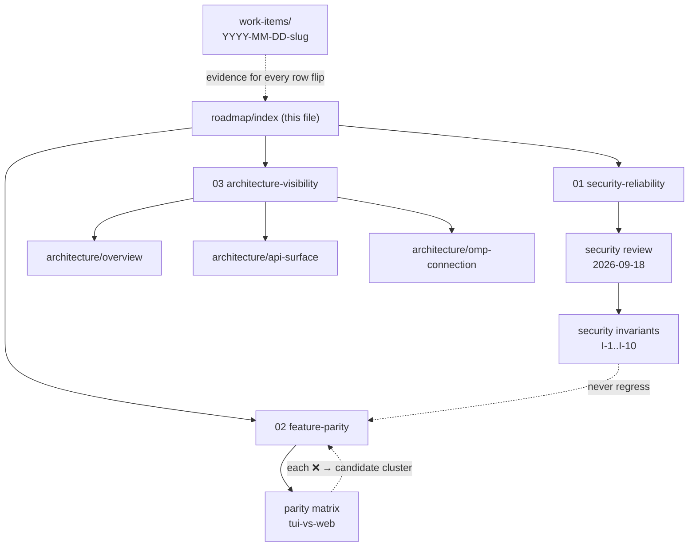

# omp-ui roadmap (MOC)

> [!goal] Mission (from `AGENTS.md`)
> Develop and maintain a **secure and reliable** web UI for omp that is
> **feature-rich** and strives to **match the OMP TUI**. Three pillars, one
> per objective; every work session logs to [[docs/work-items/TEMPLATE|a timestamped work item]].

## The three pillars

| # | Pillar | Objective | State |
|---|--------|-----------|-------|
| 1 | [[docs/roadmap/01-security-reliability\|Security & Reliability]] | safe to run (incl. LAN), reliable enough to trust | baseline review ✅ → S1–S3 open |
| 2 | [[docs/roadmap/02-feature-parity\|TUI Feature Parity]] | close the TUI↔web gap, cluster by cluster | matrix ✅ → **P0: pick first sprint** |
| 3 | [[docs/roadmap/03-architecture-visibility\|Architecture Visibility]] | the whole UI + API + omp connection, diagrammed and maintained | A1–A4 ✅ · A5 table ✅ |

## The knowledge graph (how these files relate)

## Current state (2026-09-18)

- ✅ Fork bootstrapped: governance, gates, work-log, security baseline,
  architecture docs — [[docs/work-items/2026-09-18-bootstrap]]
- ✅ macOS test suite green (was structurally red; CI covers ubuntu+windows only)
- 🚧 **Decision needed (P0):** first parity cluster — proposed order in
  [[docs/roadmap/02-feature-parity]]: collab/share → rewind/checkpoint →
  native plan mode → agent-hub control → …
- Open hardening: **S1** mask `models.yml` keys · **S2** LAN TLS guidance ·
  **S3** invariant tests

## Conventions

- Roadmap rows carry stable ids (**S/R/P/A**); work items reference them in
  `relates-to:`; matrix rows flip ✅ only with a work-item + commit link.
- New files spawn from here: new pillar → table row above; new cluster →
  section in pillar 02; new finding → row in [[docs/security/invariants]].
- `docs/` is an Obsidian vault: frontmatter + `[[wikilinks]]` + Mermaid.
