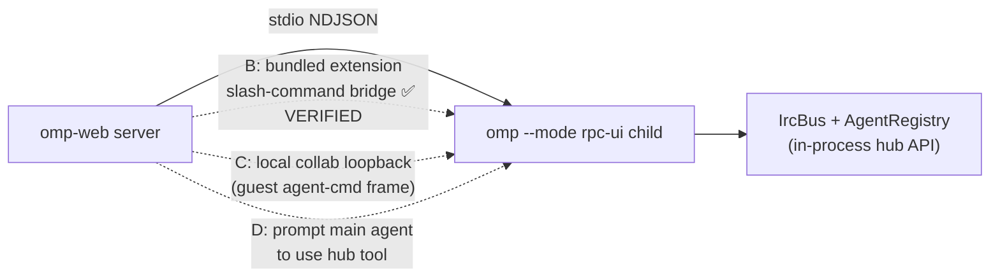

# Agent Hub — scope, feasibility & dashboard-view study

> [!goal] Purpose
> Planning doc for roadmap cluster **P4 — Agent Hub control**
> ([[docs/roadmap/02-feature-parity]]). Part 1 scopes the work and proves the
> feasibility of each control path with evidence. Part 2 studies real
> agent-hub/dashboard products and distills view archetypes with pros/cons, so
> the hub *shape* can be chosen before implementation starts. **No code is
> committed by this doc; implementation waits for a decision.**

**TL;DR**

- The web already has ~70 % of the hub's *read* surface (roster, progress,
  transcripts, on-disk history). The missing piece is **control** — chat /
  kill / revive — and **omp 18.2.5 exposes no RPC command for it** (verified
  against the shipped binary).
- **Control is achievable today without touching omp source**: a bundled
  **bridge extension** loaded via `-e` reaches the same in-process
  singletons omp's own collab host uses (`AgentRegistry` /
  `AgentLifecycleManager`). Verified end-to-end by spike — §3.1.
  (Constraint recorded 2026-09-19: **no omp source modification** — we build
  on top; the upstream RPC command stays a long-term ask, not a dependency.)
- View study → the field converges on **roster + peek + focus** (Claude Code
  agent view is the reference). For omp's *subagent* semantics (parent-owned,
  nested lineage, one session at a time) the best fit is a
  **Roster+Inspector hub with an attach/focus mode**, not a kanban or a
  mission-control grid. Details in §6–7.

---

## 1. What the TUI Agent Hub is

Source: `omp://agent-hub.md` (omp 18.2.5). The hub is the interactive surface
for **subagents of the current session** — a live roster, per-agent activity
and usage, transcript access, steering, revive, and kill. The main agent is
not listed (its conversation is the ambient view).

| Capability | Detail |
|---|---|
| Open | `Alt+A` (`app.agents.hub`), `Ctrl+S` (legacy observe), double-`←` on empty editor |
| Roster rows | status (`running`/`idle`/`parked`/`aborted`), identity, **parent**, **unread IRC count**, model role + resolved model, age since last activity, task/current activity, cost, active time, request count, tool-call count, tokens |
| Header | aggregate status + usage across measured agents |
| Views | `t` toggles flat ↔ **parent/child tree**; `Tab`/wide layout toggles the **inspector** |
| Inspector | current tool + arguments, last intent, retry state, context-window use, parent/child lineage, output + patch paths, isolated-worktree branch |
| Controls | `Enter` focus (revives parked), `r` revive parked, `x` abort-then-kill, `Esc` back |
| Focus & steer | focusing swaps the whole TUI to the subagent: live transcript + editor; steering uses the normal prompt path (persisted to the subagent's history); double-`←`/`Esc` returns |
| Transcript viewer | full-screen tail for non-focusable rows (collab guests, advisors); input line only when the agent is messageable |
| Pinned jump list | `Subagents` block above the editor; collapsed/full/off (`display.pinnedAgents`); click-to-focus with `tui.mouse` |
| Persisted agents | resume scans the session's artifact tree → historical JSONLs become **parked** rows; killed agents keep an `aborted` tombstone; lineage preserved |
| Advisors | `__advisor*.jsonl` → read-only rows: transcript yes; message/revive/kill **never** (also enforced for collab guests) |
| Adjacent | `/jobs` snapshot; `history://<id>`; `agent://<id>`; `hub` tool (`list`/`send` — send revives parked) |

Control semantics that matter for the web:

- **Steer = normal prompt path** → message lands in the subagent's persisted
  history (same as the TUI).
- **Revive is bound to the parked agent reference + transcript**; only
  `parked` agents can be revived; messaging a parked agent *is* the revive
  primitive (`hub send` receipts: `injected`/`woken`/`revived`/`failed`).
- **Kill is immediate** (abort running turn if needed, then release) — the TUI
  warns it is destructive; the web should confirm.

## 2. What the web has today

Verified against this repo at HEAD (2026-09-19):

| Hub capability | Web state | Where |
|---|---|---|
| Live roster + chips | ✅ | `components/ComposerPanels.tsx` (pinned above composer, collapsible, live telemetry lines) |
| Progress frames | ✅ | `subagent_lifecycle` / `subagent_progress` / `subagent_event` SSE → `lib/subagent-types.ts` defensive parsers, `mergeSubagentRoster` fold |
| Roster hydration | ✅ | `get_subagents` snapshots on mount/send/reconcile (`refreshSubagentRoster`) |
| Transcripts | ✅ | `SubagentTranscriptDialog` — completion view (`?mode=completion` tail) + byte-paged raw transcript; live `subagent_event` activity buffer |
| On-disk history | ✅ | `lib/subagent-history.ts` (`extractSubagentHistory`) + `GET /api/sessions/[id]/subagents[/:subagentId]`; id validated `[A-Za-z0-9_-]{1,80}` before path join |
| In-message task summary | ✅ | `MessageView` TaskResultPanel (size-bounded telemetry) |
| Inspector detail | 🟡 | dialog shows assignment + completion + activity; no current-tool/args, lineage, patch/worktree paths, context gauge per agent |
| Flat ↔ tree | ❌ | roster is flat only |
| Parked / idle rows | ❌ | `parseSubagentSnapshot` **rejects** statuses outside `started/completed/failed/aborted` — the registry's `parked`/`idle` vocabulary is dropped today |
| Parent lineage, unread IRC | ❌ | not parsed from snapshots |
| **Chat / steer a subagent** | ❌ | no control surface |
| **Kill / revive** | ❌ | no control surface |
| Advisor rows | ❌ | not surfaced |
| Focus/attach mode | ❌ | dialog is the deepest view |

## 3. The control gap — feasibility evidence

**The RPC protocol has no subagent control command.** Verified two ways on
the installed `omp 18.2.5` (`~/.bun/bin/omp`, Mach-O bundle):

1. `omp://rpc.md` command schema: subagent surface is exactly
   `set_subagent_subscription`, `get_subagents`, `get_subagent_messages`.
2. The compiled binary's RPC dispatch table (extracted via `strings` around
   the `case "get_subagents"` site) contains **no** `subagent_*` control case.
   Full command set: abort, abort_and_prompt, abort_bash, abort_retry, bash,
   branch, capabilities, close, compact, cycle_model, cycle_thinking_level,
   download, export_html, follow_up, get_available_commands,
   get_available_models, get_branch_messages, get_last_assistant_text,
   get_login_providers, get_messages, get_messages_page, get_session_stats,
   get_state, get_subagent_messages, get_subagents, handoff, login,
   negotiate_protocol, new_session, ping, prompt, run, set_auto_compaction,
   set_auto_retry, set_fast_mode, set_follow_up_mode, set_host_tools,
   set_host_uri_schemes, set_interrupt_mode, set_model, set_session_name,
   set_steering_mode, set_subagent_subscription, set_thinking_level,
   set_todos, steer, stream_audio, stream_cancel, stream_stop,
   switch_session, transcribe.

> [!warning] Roadmap correction
> [[docs/roadmap/02-feature-parity]] P4 lists the precondition as
> *"none — RPC `agent-cmd` equivalents exist"*. That is **wrong at the stdio
> RPC layer**: `agent-cmd` is a **collab guest→host frame** (see
> `omp://collab.md`: guests with a full link can "use Agent Hub against the
> host's subagents: chat, kill, revive"). The capability exists in-process and
> on the collab wire — not on the stdio RPC the web speaks. The roadmap row
> must be corrected when this cluster is scheduled.

Where control actually lives inside omp: the process-global **IrcBus +
AgentRegistry + agent-lifecycle** (`omp://tools/hub.md`), which the TUI hub
and the collab host controller both call directly.

### Control-path options



| | Option | How | Verdict |
|---|---|---|---|
| **A** | Upstream RPC command (e.g. `subagent_cmd {action: chat\|kill\|revive, subagentId, message?}`) | omp's collab host already implements chat/kill/revive handlers; the RPC case is a thin wrapper reusing them. Web side: add to `PASSTHROUGH_COMMANDS`, capability-gate on `getOmpVersion()` | ⏭ Long-term ask only — **ruled out as the path (2026-09-19): no omp source modification.** File upstream as the durable replacement; the bridge (§3.1) swaps to it with no UI/route changes |
| **B** | **Bundled extension bridge** | spawn child with `-e <path>` (explicit `-e` paths load even under `--no-extensions`); extension registers one slash command; web sends it over the existing `prompt` path; results return via `extension_ui_request` notify frames | ✅ **Recommended — spike-verified (§3.1).** Reaches the exact control primitives omp's collab host calls. Risk: deep specifiers are host internals → probe-gated UI + small surface + upstream ask as exit ramp |
| **C** | Local collab loopback | have the child host a collab room on a localhost relay (`ws://localhost:…` is an accepted link form); ompweb joins as a full-link guest and speaks `agent-cmd` | ❌ Rejected. Works today but: extra relay process (the bundled relay is a dev stand-in), room lifecycle driven by parsing `/collab` prompt output, key/token custody, E2E crypto for a local hop, two event transports to reconcile. Violates the one-process-per-session design |
| **D** | Delegate to the main agent | prompt the main session to run its `hub` tool (`send` steers/revives) | ❌ Not a control surface: consumes a main-agent turn, requires the main agent idle, pollutes session history, non-deterministic, and **`hub` has no kill op**. The main agent can already do this on its own — the web should not fake it |

**Conclusion:** control is **unblocked without modifying omp** — the
extension bridge is spike-verified against omp 18.2.5 (§3.1). The read-only
hub (Phase 1) is independently unblocked. The upstream `subagent_cmd` ask
(Option A) is filed as the durable long-term path, not a precondition.

## 3.1 Extension bridge spike — verified on omp 18.2.5 (2026-09-19)

Throwaway probe extension + `omp --mode rpc-ui --cwd <tmp> -e ext.ts`
(probes 1–5 cost zero model calls):

| # | Probe | Result |
|---|---|---|
| 1 | `pi.registerCommand` + `ctx.ui.notify` under `--mode rpc-ui` | ✅ handler executes; result reaches the RPC client as an `extension_ui_request` `notify` frame |
| 2 | `pi.pi` package exports | ✅ 612 exports incl. `AgentRegistry`, `HubTool`, `MAIN_AGENT_ID`, `isReadOnlyAgent`, `collectIrcPeerRoster` |
| 3 | dynamic `import("@oh-my-pi/pi-coding-agent/registry/agent-registry")` | ✅ `AgentRegistry.global()` → `get, list, listVisibleTo, setStatus, setActivity, attachSession, unregister, isRunning, syncSessionStatus, onChange` (n=1: main agent registered) |
| 4 | `…/registry/agent-lifecycle` | ✅ `AgentLifecycleManager.global()` → `adopt, park, ensureLive, release, reclaimDeadCorpse, manages, isParking, dispose` — **the hub's control primitives** |
| 5 | bare root import `@oh-my-pi/pi-coding-agent` | ❌ not rewritten by the compat loader — **deep specifiers only** |
| 6 | dispatch **during an active model stream** | ✅ `/spike-ping` → `pong` arrived between `agent_start` and `agent_end`, with and without `streamingBehavior` — local extension commands never queue behind the main run |

The collab host's `agent-cmd` handler (same binary, extracted source) is the
reference the bridge mirrors — same singletons, same calls:

```ts
// chat   → AgentLifecycleManager.global().ensureLive(id)
//            .then(a => a.prompt(text, { streamingBehavior: "steer" }))
// revive → AgentLifecycleManager.global().ensureLive(id)
// kill   → rec.status === "running" && rec.session?.abort({ reason })
//          → AgentLifecycleManager.global().release(id, rec, { tombstone: true })
// guard  → AgentRegistry.global().get(id)?.kind === "advisor" → reject
```

Bridge shape (~120 lines): one command `/ompweb-hubctl <chat|kill|revive>
<agentId> <nonce> [text…]`; handler runs the guard + the call above and
notifies JSON `{nonce, ok, error?}`; the web correlates the notify frame by
nonce. `…/registry/persisted-agents` (also resolvable) covers
parked-from-disk revival, mirroring the TUI hub's artifact scan. Bridge
commands appear in `available_commands_update` with `source: "extension"` —
the web palette filters them out.

## 4. Scope (phased)

### Phase 1 — Read-only hub view (unblocked)

- **Data layer** (`lib/subagent-types.ts`, `lib/subagent-history.ts`):
  accept the registry status vocabulary (`running`/`idle`/`parked`/`aborted`
  + tombstones) alongside task-lifecycle statuses without fabricating live
  chips; parse `parent`, unread-IRC count, patch/output paths, worktree
  branch; advisor-row kind (`__advisor*.jsonl`, read-only).
- **API**: extend `GET /api/sessions/[id]/subagents` to merge live + disk
  (parked rows on resume, mirroring the TUI artifact scan); header aggregate
  (status counts + summed cost/tokens/time).
- **UI**: hub view (shape per §6–7 decision) reachable from the composer
  panel; flat ↔ lineage-tree toggle; inspector panel; age/live clocks.
- **Tests**: status-vocabulary parsers, roster fold with parked rows,
  advisor read-only enforcement, route merge precedence.
- **Docs**: parity matrix row `Agent Hub` ❌→🟡, work item, CHANGELOG.
- Effort: **M** (1–2 sessions).

### Phase 2 — Control via the bundled bridge extension (unblocked)

- **Bridge**: `lib/omp/hub-bridge.ts` shipped with ompweb, loaded via
  `-e <path>` appended in `buildSessionSpawnArgs` (explicit `-e` paths load
  even under `--no-extensions`). Self-probes the deep imports on load and
  notifies a `ready`/`unavailable` frame; the web gates all control UI on
  that probe — capability detection without version pinning.
- **Route**: `POST /api/sessions/[id]/subagents/[subagentId]/actions`
  `{action: "chat"|"kill"|"revive", message?}` — body-bounded, id validated
  `[A-Za-z0-9_-]{1,80}`, covered by `proxy.ts` automatically; sends the
  bridge command over the existing `prompt` path with a nonce; resolves on
  the matching notify frame (timeout → 504).
- UI: kill confirm (destructive, like TUI `x`), revive on parked rows, chat
  input in hub/peek; receipts surfaced as toasts.
- Advisor read-only guard enforced in **route and bridge** — never UI-only.
- Risk register: deep specifiers are host internals reachable through the
  documented compat loader but not a documented API — an omp upgrade can
  break them. Mitigations: probe-gated UI (worst case = today's read-only
  hub), ~120-line surface, and the upstream `subagent_cmd` ask as the exit
  ramp (route/UI unchanged when the bridge swaps to a real RPC command).
- Effort: **M** (bridge + route + nonce correlation + UI + tests).

### Phase 3 — Focus / steer UX (rides on Phase 2)

- Attach-style view: swap the chat surface to the subagent (live transcript
  via existing paging + `subagent_event` tail; input line gated by
  messageability), `←`-equivalent back to hub/main.
- Effort: **M**.

## 5. Dashboard-view study — what shipped products do

Sources researched 2026-09-19 (aiseek; extracted from vendor docs/repos):
Claude Code agent view (`code.claude.com/docs/en/agent-view`), Cursor 2.0
changelog + Cursor 3 blog, Vibe Kanban (BloopAI, GitHub — **now sunsetting**),
Claude Squad (smtg-ai, GitHub), Omnara (GitHub), Conductor (conductor.build +
docs + reviews), Langfuse agent graphs, Devin "managed Devins" (Cognition
blog), omp TUI agent-hub docs.

### A1 · Roster + Inspector (master/detail) — *the field default*

One dense list, one detail pane. **omp TUI hub**, **Claude Code agent view**
(`claude agents`: rows grouped by state — Needs input / Ready for review /
Working / Completed — each row = name + one-line activity + age + PR link),
**Devin** session lists, **Claude Squad** (roster + embedded terminal).

- ✅ Highest monitoring density; scales to dozens of agents; direct
  keyboard affordances (reply/kill/rename/pin from the row); the only shape
  that matches the TUI 1:1.
- ✅ Claude Code's **LLM-generated row summary** (Haiku-class, refreshed ≤
  every 15 s + per turn) is the killer trick: status without opening
  transcripts. omp-web equivalent: derive from `subagent_progress`
  current-tool/intent lines (already on the wire, no extra model call).
- ❌ Dense rosters read as "ops consoles"; poor on mobile; a table alone
  doesn't show *what* an agent produced (needs peek/attach companions).

### A2 · Peek panel + quick reply (companion to A1)

Claude Code: `Space` on a row → panel with the *one sentence that matters*
(the question it's asking / its result / its status line) + a reply input;
numbered answers for choice questions; `!` prefix for bash. Never leaves the
roster.

- ✅ Fastest intervene path; turns the hub from monitoring into control
  without a mode switch; low screen real estate.
- ❌ Depends on a control path existing at all; summary quality is a
  model-call cost/latency question.

### A3 · Focus / Attach (immersive agent view)

Claude Code attach (`Enter`/`→` → full session, `←` detaches, attach posts a
recap); omp TUI focus (transcript + status + editor become the subagent's);
Claude Squad attach/embedded terminal.

- ✅ The only shape where *steering a running agent* feels natural — full
  transcript context + input, exactly the TUI's model.
- ✅ Maps cleanly onto omp-web's existing tab architecture (a hub tab could
  swap `ChatWindow`'s data source to the subagent's transcript).
- ❌ One-at-a-time by nature; needs a clear "you are looking at a subagent,
  Esc returns" chrome; control-gated.

### A4 · Card grid / mission control

**Conductor** (workspace per task: branch, terminal, diff, status at a
glance; multiplayer; microVM sandboxes), **Cursor 3 Agents Window** (sidebar
of all local+cloud agents from mobile/web/desktop/Slack/GitHub/Linear;
cloud agents produce *demos and screenshots* for verification), **Codex
cloud** task cards, **Omnara** dashboard (per-agent pages, Slack connector,
durable state, RBAC).

- ✅ Best glanceability of *outcomes* (diffs, previews, artifacts), good for
  independent long-running tasks; friendly to non-experts; scales visually.
- ❌ Cards waste space for a *nested* fleet (subagents are children, not
  peers); weak status density past ~12 cards; each card wants a preview
  artifact omp subagents don't produce (no per-agent diff/preview surface —
  worktree isolation exists but web has no diff-per-subagent view wired).
- ⚠️ Fit caveat: these products manage **peer top-level sessions**; omp's
  hub manages **one session's children**. The peer-grid metaphor misleads.

### A5 · Kanban board (status columns)

**Vibe Kanban**: plan issues on a board → workspace per agent (branch,
terminal, dev server) → inline diff comments → PR. Note: **sunsetting** —
the market signal is that planning-board + agent-executor hybrids didn't
stick for personal fleets.

- ✅ Great for *task intake* (what should agents do), team-visible;
  status columns mirror agent lifecycle.
- ❌ Wrong axis for a subagent hub: omp subagents aren't user-planned
  work items — the **main agent** plans them. Board cells imply user-owned
  backlog the hub doesn't have. High cost, low parity value.

### A6 · Lineage tree / graph

omp TUI `t` (flat ↔ parent/child tree); **Langfuse agent graphs**
(aggregated: one node per step name with counters, cycles; expanded: one
node per call, unrolled DAG); **Devin managed sessions** (coordinator +
child session links, parent reads child trajectories).

- ✅ omp's nested subagents (subagents spawning subagents) genuinely form a
  tree — lineage is *real data* (`parentToolCallId`, nested task progress
  already parsed). Trees answer "who spawned whom, where is the stall".
- ❌ As a *primary* view it's poor (deep trees, little text); as a **toggle
  over the roster** (the TUI's own choice) it's cheap and high-value.
  Full graph engines (React Flow) are overkill for depth-2–3 fleets.

### A7 · Timeline / trace (Gantt, waterfall)

Observability tools (LangSmith/Langfuse/AgentOps): spans over time, nested
waterfall, cost/token annotations per span.

- ✅ Unmatched for post-hoc debugging ("why did the batch take 9 minutes —
  oh, scout #2 retried 4×"); cost analysis over time.
- ❌ Not a *control* surface; needs event timestamps omp's progress frames
  only partially carry; high build cost; a session-stats view, not a hub.
  Better as a future stats-tab enhancement.

### A8 · Inline nested transcript (status quo)

omp-web today: task tool-calls expand in-message; TaskResultPanel summary;
chip panel above the composer. Anthropic's multi-agent research UI uses the
same idea (lead agent's narrative + expandable per-subagent process
sections).

- ✅ Zero context-switch; the spawn event stays where the conversation
  happened.
- ❌ Scrolls away; can't monitor a fleet over time; no control. This is the
  *ambient* layer the hub complements — keep it, don't grow it into the hub.

### A9 · Needs-input inbox (action queue)

Claude Code groups `Needs input` at the top, tints the terminal tab with the
awaiting count, and fires notifications on needs-input/complete; Devin
surfaces plan gates for approval.

- ✅ The single highest-ROI *behavior* in the study: a hub that only shows
  status is a dashboard; one that says **"2 agents need you"** is an
  inbox. omp analog: subagents blocked on approval/ask + completion events →
  badge on the hub chip + browser Notification (web already has the
  notification plumbing for agent_end).
- ❌ Requires omp to surface blocked-on-approval state per subagent —
  verify what `subagent_progress` exposes; may be partial.

## 6. Comparison matrix

Fit scored against **omp's actual data surface** (roster + progress +
transcript paging today; control later) and omp's semantics (children of one
session, nested lineage, single-user, LAN-first).

| Archetype | Monitor density | Control affordance | Lineage fit | Transcript access | Build cost | Mobile | TUI parity |
|---|---|---|---|---|---|---|---|
| A1 Roster+Inspector | ★★★ | ★★ (rows host actions) | ★★ (tree toggle) | ★★ (opens A3) | **M** | ★ | ★★★ |
| A2 Peek+reply | ★★ | ★★★ | ★ | ★ | S (on A1) | ★★ | ★★ |
| A3 Focus/attach | ★ | ★★★ | ★ | ★★★ | M (P2-gated) | ★★ | ★★★ |
| A4 Card grid | ★★ | ★★ | ★ (peers, not children) | ★ | L | ★★★ | ★ |
| A5 Kanban | ★ | ★ | ✗ | ✗ | L | ★★ | ✗ |
| A6 Tree/graph toggle | ★★ | ★ | ★★★ | ✗ | S–M | ★ | ★★★ |
| A7 Timeline | ★★ | ✗ | ★★ | ★ | L | ★ | ✗ |
| A8 Inline (status quo) | ★ | ✗ | ★ | ★★ | — | ★★ | ★ |
| A9 Needs-input | ★★★ | ★★★ | ✗ | ✗ | S | ★★★ | ★★ |

## 7. Recommended shape (for decision)

**"Roster + Peek + Focus" — the TUI's own architecture, web-native:**

1. **Hub view** = A1 roster (flat ↔ tree toggle, A6) with inspector, opened
   from the composer panel / ⌘K. Phase 1 read-only.
2. **Peek** = A2 hover/expand with the one-line activity + reply input once
   control lands.
3. **Focus** = A3 swap the chat surface to the subagent (Esc/double-`←`
   back), the TUI's strongest gesture, on a web tab.
4. **A9 inbox behavior** layered on the roster (needs-input group + badge +
   browser notification) — cheap, changes the product's feel.
5. Keep A8 (inline task panels) as the ambient layer; **don't** build A4/A5
   — they manage peer sessions, not one session's children, and the market
   signal (Vibe Kanban sunset) is cautionary. A7 stays a candidate for the
   stats tab, not the hub.

This ordering ships the read-only hub first; control (Phase 2, bridge-verified)
is additive on top — never a rework.

## 8. Decisions

1. **View shape** — ✅ **decided (2026-09-19): Roster + Peek + Focus** (§7).
2. **Control bridge** — ✅ **decided direction: no omp source modification.**
   The verified path is the bundled bridge extension (§3.1) loaded via `-e`.
   The upstream `subagent_cmd` RPC ask (Option A) is filed as the durable
   long-term replacement, not a precondition.
3. **Sequencing** — open: Phase 1 read-only first, or Phase 1+2 together now
   that control is unblocked. (Recommendation: Phase 1 first — the hub view
   is the bigger build and the bridge rides on its data layer.)
4. Roadmap P4 precondition text gets corrected when the cluster is scheduled.

## 9. Follow-ups (when scheduled)

- [ ] Correct P4 precondition in [[docs/roadmap/02-feature-parity]].
- [ ] Prototype the real bridge command (`/ompweb-hubctl`) incl. nonce
      correlation and `persisted-agents` parked revival; exercise chat /
      kill / revive against a live parked subagent end-to-end.
- [ ] Verify which registry fields `get_subagents` snapshots actually carry
      (parent, unread IRC, parked) against a live 18.2.5 child — drives the
      Phase 1 parser scope.
- [ ] Verify `subagent_progress` blocked-on-approval exposure → feeds the
      A9 needs-input design.
- [ ] Optional upstream issue: `subagent_cmd` RPC command wrapping the same
      `AgentLifecycleManager` handlers the collab host calls (durable path;
      not blocking).
- [ ] Work item `docs/work-items/<date>-agent-hub-phase1.md` on kickoff.
